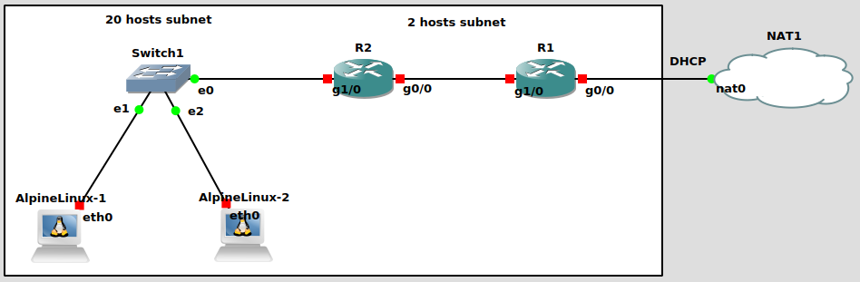

# KIV-PSI-4HW
Fourth HW assigned in KIV/PSI

1) Popis prvků + konfigurace

Podkapitoly obsahují popis jednotlivých prvků, jež jsou přítomny ve schématu sítě. Kde je to potřeba, je popsán i postup, jaký konfigurační postup byl u daného zařízení proveden.

1.a) NAT1

Reprezentuje poskytovatele internetu. Dodá IP adresu, kterou jsme identifikovatelní v rámci internetu.

1.b) R1

Router typu Cisco 7200 běžící na systému Cisco IOS - verze 15.0(1)M.

Postup konfigurace:
- "configure terminal"
  - příkaz otevře konfigurační rozhraní routeru
- "interface gigabitEthernet 0/0"
  - chci konfigurovat port, který je propojen s NAT1
- "ip address dhcp"
  - chci získat adresu pomocí dhcp
- "ip nat outside"
  - nastavení typu překladu IP adres
- "no shutdown"
  - povolení portu / rozhraní
- "exit"
  - odejdu z konfigurace konkrétního rozhraní  
- "interface gigabitEthernet 1/0"
  - chci konfigurovat port, který je propojen s R2
- "ip address 192.168.123.253 255.255.255.252"
  - nastavení síťové adresy a masky
  - dvě použitelné adresy: 192.168.123.253 a 192.168.123.254
- "ip nat inside"
  - nastavení typu překladu IP adres
- "no shutdown"
  - povolení portu / rozhraní
- "exit"
  - odejdu z konfigurace konkrétního rozhraní 
- "ip route 192.168.123.0 255.255.255.0 gigabitEthernet 1/0"
  - nastavení routovací tabulky, přidání dalšího hopu
- "access-list 1 permit 192.168.123.0 0.0.0.255"
  - vytvoření pravidla ACL, povolení všech IP z daného rozmezí
- "ip nat inside source list 1 interface gigabitEthernet 0/0 overload"
  - aplikování vytvořeného ACL pravidla na rozhraní 
- "exit"
  - odejdu z konfiguračního terminálu
- "copy running-config startup-config"
  - označím právě nastavenou kofiguraci jako startovní, zkopíruju ji
  - je potřeba potvrdit přepsání předchozí konfigurace (2x Enter)

1.c) R2

Router typu Cisco 7200 běžící na systému Cisco IOS - verze 15.0(1)M.

Postup konfigurace:
- "configure terminal"
  - příkaz otevře konfigurační rozhraní routeru
- "interface gigabitEthernet 0/0"
  - chci konfigurovat port, který je propojen s R1
- "ip address 192.168.123.254 255.255.255.252"
  - nastavení síťové adresy a masky
- "no shutdown"
  - povolení portu / rozhraní
- "exit"
  - odejdu z konfigurace konkrétního rozhraní 
- "interface gigabitEthernet 1/0"
  - chci konfigurovat port, který je propojen se switchem Switch1
- "ip address 192.168.123.1 255.255.255.224"
  - nastavení síťové adresy a masky
- "no shutdown"
  - povolení portu / rozhraní
- "exit"
  - odejdu z konfigurace konkrétního rozhraní
- "ip route 0.0.0.0 0.0.0.0 192.168.123.253"
  - nastavení cesty přes router R1
- "ip dhcp excluded-address 192.168.123.1 192.168.123.10"
  - vynechám prvních 10 možných IP, vznikne pool 20 přidělitelných
  - první přidělená IP by měla být 192.168.123.11
- "ip dhcp pool 20_IP_POOL"
  - definuji pool IP adres, které se budou přidělovat klientům
- "network 192.168.123.0 255.255.255.224"
- "default-router 192.168.123.1"
- "dns-server 8.8.8.8 8.8.4.4"
  - použiji Google DNS servery
- "exit"
  - odejdu z konfigurace dhcp
- "exit"
  - odejdu z konfiguračního terminálu
- "copy running-config startup-config"
  - označím právě nastavenou kofiguraci jako startovní, zkopíruju ji
  - je potřeba potvrdit přepsání předchozí konfigurace (2x Enter)
1.d) Switch1

Klasický switch, na který jsou připojena síťová zařízení

1.e) AlpineLinux-1
- Alpine Linux virtuál, image viz https://gns3.com/marketplace/appliances/alpine-linux-2
- "udhcpc"
  - request pro získání nové IP adresy 

1.f) AlpineLinux-2
- Alpine Linux virtuál, image viz https://gns3.com/marketplace/appliances/alpine-linux-2
- "udhcpc"
  - request pro získání nové IP adresy

2) Spuštění konfigurace + otestování

Pro správné spuštění je potřeba importovat image Alpine Linuxu, viz https://gns3.com/marketplace/appliances/alpine-linux-2.

Po spuštění všech zařízení v konfiguraci je potřeba u strojů "AlpineLinux-1" a "AlpineLinux-2" spustit příkaz "udhcpc", který stroji přidělí novou IP adresu. Jeden ze strojů by měl získat IP adresu "192.168.123.11", druhý pak "192.168.123.12".

Následně lze otestovat ping pomocí příkaz "ping www.google.cz".
